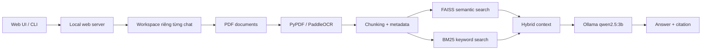

# Paperwise

<div align="center">

**Trợ lý hỏi đáp PDF chạy local, hiểu tiếng Việt, tôn trọng tài liệu của bạn.**

[](https://www.python.org/)
[](https://ollama.com/)
[](https://ollama.com/library/qwen2.5)
[](https://github.com/facebookresearch/faiss)
[](https://en.wikipedia.org/wiki/Okapi_BM25)
[](#privacy)
[](#kiểm-tra)

</div>

Paperwise là ứng dụng hỏi đáp tài liệu PDF dành cho học tập, ôn thi và tra cứu nội bộ. Bạn import tài liệu, chọn phạm vi trang cần lập chỉ mục, build một lần rồi trò chuyện với nội dung đã chọn.

Không cần gửi PDF lên cloud. Sau khi tải model lần đầu, luồng hỏi đáp có thể chạy local qua Ollama.

## Điểm nổi bật

- **Web UI local** tại `127.0.0.1:8000`, giao diện chat gọn như các sản phẩm AI hiện đại.
- **Import PDF trực tiếp trên web**, không cần tự chép file vào thư mục dữ liệu.
- **Build có kiểm soát**: chọn trang bắt đầu, số trang hoặc toàn bộ tài liệu.
- **Theo dõi tiến độ** và ước tính thời gian build.
- **Hybrid retrieval** kết hợp FAISS cho ngữ nghĩa và BM25 cho từ khóa.
- **Citation theo file và trang** để kiểm tra câu trả lời.
- **Long-answer mode** tự mở rộng context cho các yêu cầu như “trình bày toàn bộ câu 6”.
- **Workspace riêng cho từng cuộc trò chuyện**: tài liệu, index và lịch sử không dùng chung.
- **Quản lý dữ liệu**: xóa từng PDF, xóa toàn bộ tài liệu/index hoặc xóa lịch sử chat.
- **OCR PDF scan** bằng PaddleOCR, xử lý từng trang để giảm đỉnh RAM.
- **REPL CLI** cho trường hợp muốn hỏi trực tiếp từ terminal.

## Demo workflow

```text
Mở web → Import PDF → Chọn phạm vi trang → Build chỉ mục → Đặt câu hỏi
```

> Lần build đầu có thể lâu vì OCR, embedding và tải model. Sau khi index xong, các câu hỏi tiếp theo không cần OCR lại.

## Yêu cầu

- Windows 10/11 khuyến nghị.
- Python 3.11+.
- RAM tối thiểu 8 GB; 16 GB phù hợp hơn với PDF scan lớn.
- Ollama chạy local.
- Poppler nếu cần OCR PDF scan trên Windows.
- Internet chỉ cần khi cài package và tải model lần đầu.

## Cài đặt nhanh

### 1. Tạo và kích hoạt môi trường Python

```powershell
python -m venv venv
.\venv\Scripts\Activate.ps1
```

Nếu PowerShell chặn script trong phiên hiện tại:

```powershell
Set-ExecutionPolicy -Scope Process -ExecutionPolicy RemoteSigned
.\venv\Scripts\Activate.ps1
```

### 2. Cài dependency

```powershell
python -m pip install -r setup.txt
```

### 3. Cài và chuẩn bị Ollama

Cài Ollama từ [ollama.com/download/windows](https://ollama.com/download/windows), sau đó mở Ollama hoặc chạy:

```powershell
ollama serve
ollama pull qwen2.5:3b
```

Kiểm tra model:

```powershell
ollama list
```

Model mặc định được cấu hình trong [config.py](config.py). Có thể đổi model mà không sửa code:

```powershell
$env:OLLAMA_MODEL="qwen2.5:7b"
```

## Chạy Paperwise

```powershell
.\venv\Scripts\Activate.ps1
python app.py
```

Mở trình duyệt tại:

```text
http://127.0.0.1:8000
```

Giữ terminal đang chạy server mở trong lúc sử dụng.

## Sử dụng web UI

1. Bấm **Cuộc trò chuyện mới** để tạo workspace sạch.
2. Bấm **Import PDF** để thêm một hoặc nhiều PDF.
3. Chọn **Từ trang** và **Số trang**, hoặc bật **Build toàn bộ tài liệu**.
4. Bấm **Build chỉ mục**.
5. Chờ trạng thái hoàn tất rồi mới đặt câu hỏi.
6. Chọn chat cũ trong sidebar để xem lại lịch sử.
7. Xóa từng file bằng nút `×`, hoặc dùng **Xóa toàn bộ tài liệu** để xóa PDF và index của chat hiện tại.

Mỗi cuộc trò chuyện có workspace riêng:

```text
workspaces/<chat_id>/
├── documents/                 # PDF của chat này
├── vectorstores/db_faiss/    # FAISS, BM25 và manifest
└── history.jsonl              # lịch sử chat của chat này
```

## Chạy CLI

REPL tiếng Việt:

```powershell
python qabot.py
```

Hỏi một câu rồi thoát:

```powershell
python qabot.py --question "Trình bày toàn bộ câu 6"
```

Trong REPL:

```text
/help       Xem lệnh
/clear      Xóa lịch sử chat hiện tại
/sources    Xem vị trí index và history
/reload     Nạp lại bot
exit        Thoát
```

## Build bằng terminal

Build 10 trang đầu để kiểm tra nhanh:

```powershell
python build_index.py --start-page 1 --page-count 10
```

Build từ trang 11 thêm 20 trang:

```powershell
python build_index.py --start-page 11 --page-count 20
```

Build toàn bộ:

```powershell
python build_index.py --start-page 1 --page-count 0
```

Ngôn ngữ OCR mặc định là English. Đổi sang tiếng Việt nếu tài liệu phù hợp:

```powershell
python build_index.py --start-page 1 --page-count 10 --ocr-lang vi
```

## Kiến trúc ngắn gọn



### Thành phần chính

| Thành phần | Vai trò |
|---|---|
| `app.py` | Entry point chạy web UI local |
| `web_server.py` | API upload, chat, build, history và workspace |
| `ui/` | HTML, CSS và JavaScript của giao diện |
| `build_index.py` | Build FAISS/BM25 theo phạm vi trang |
| `ingestion/` | Load PDF, OCR, chunking, metadata và index |
| `qabot.py` | Retrieval, prompt grounding và Ollama answer |
| `workspaces/` | Dữ liệu tách riêng theo từng chat |
| `prepare_model/` | Chuẩn bị embedding và Ollama model |

## Privacy

- PDF import được lưu local trong workspace.
- Câu hỏi được gửi tới Ollama local, không phải API cloud.
- Không commit dữ liệu người dùng: `documents/`, `workspaces/`, `vectorstores/` và model được ignore bởi Git.
- Lần tải model/package đầu tiên cần internet; sau đó có thể chạy offline tùy môi trường.

## Kiểm tra

Chạy test:

```powershell
.\venv\Scripts\python.exe -m unittest discover -s tests
```

Kết quả hiện tại:

```text
Ran 3 tests ... OK
```

Kiểm tra syntax:

```powershell
.\venv\Scripts\python.exe -m py_compile app.py web_server.py build_index.py qabot.py
```

## Troubleshooting

### Port 8000 đã được sử dụng

Dừng server Python cũ rồi chạy lại bằng `venv`:

```powershell
Get-CimInstance Win32_Process |
  Where-Object { $_.CommandLine -match 'app\.py' } |
  ForEach-Object { Stop-Process -Id $_.ProcessId -Force }

.\venv\Scripts\Activate.ps1
python app.py
```

### Chat không mở khóa sau khi import

Bạn cần bấm **Build chỉ mục** và chờ trạng thái hoàn tất. Import file chỉ lưu PDF, chưa tạo index.

### Trả lời thiếu mục trong câu hỏi dài

Dùng các từ khóa như `trình bày toàn bộ`, `liệt kê đầy đủ` hoặc `chi tiết`. Paperwise sẽ mở rộng context sang các chunks liền kề. Model `qwen2.5:3b` cho câu trả lời dài tốt hơn `qwen2.5:1.5b` nhưng cần nhiều RAM hơn.

### Lỗi OCR hoặc MemoryError

Thử build ít trang trước:

```powershell
python build_index.py --start-page 1 --page-count 1
```

PDF scan lớn cần thời gian OCR. Không đóng server khi build đang chạy.

### FAISS báo lỗi deserialize

Ứng dụng đã dùng chế độ local index:

```python
FAISS.load_local(path, embedding, allow_dangerous_deserialization=True)
```

Chỉ load các index do chính ứng dụng tạo trong workspace local.

## Gợi ý commit

```text
feat: build local PDF chat workspaces with import and scoped indexing
```

Hoặc ngắn hơn:

```text
feat: add local Paperwise PDF chat UI
```

## License

Phát hành theo [MIT License](LICENSE). Bạn có thể sử dụng, sao chép, chỉnh sửa
và phân phối project theo các điều khoản trong file license.
